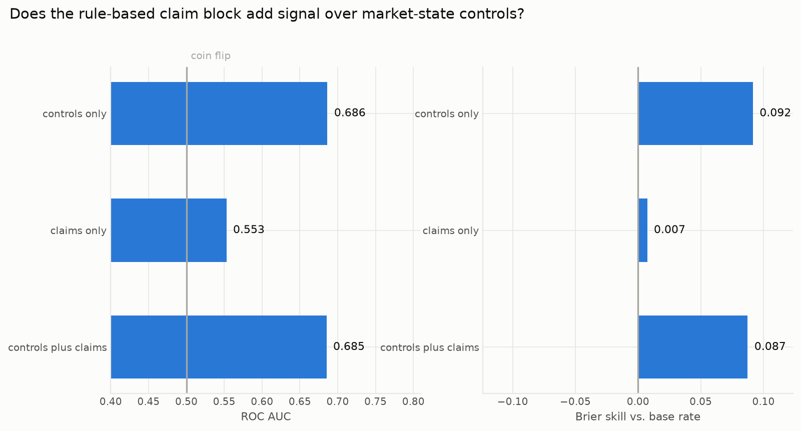
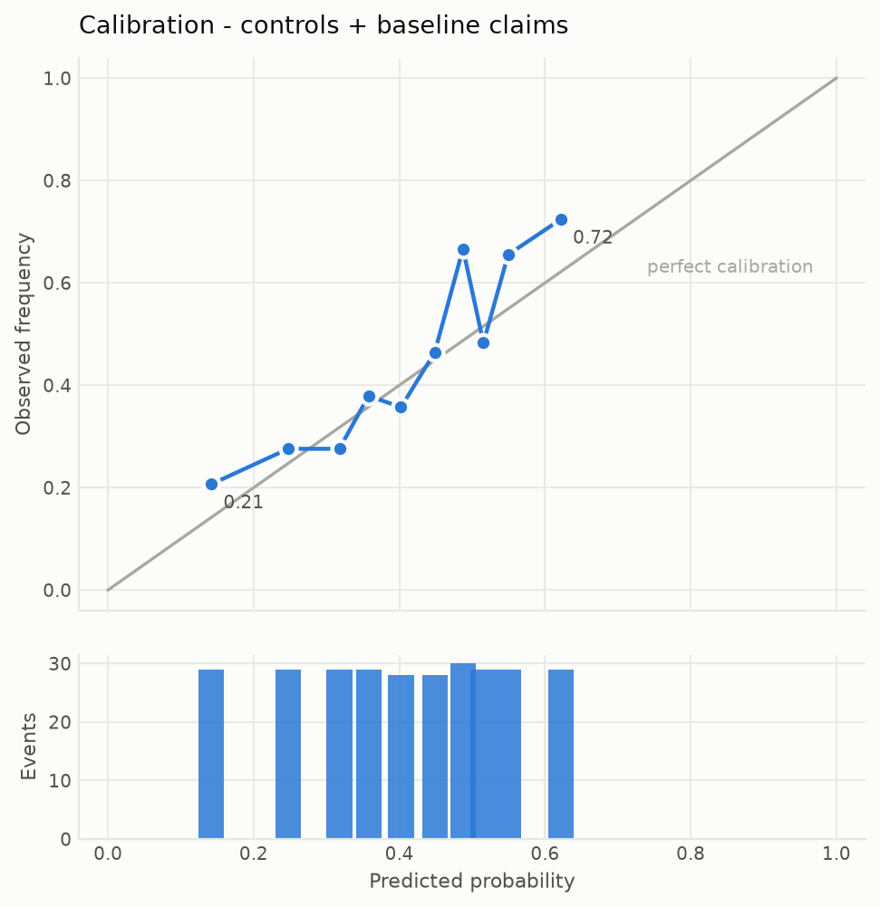
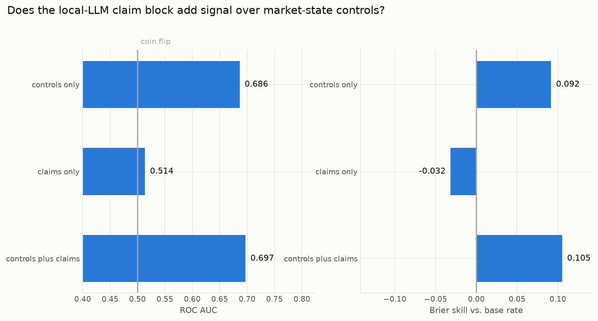
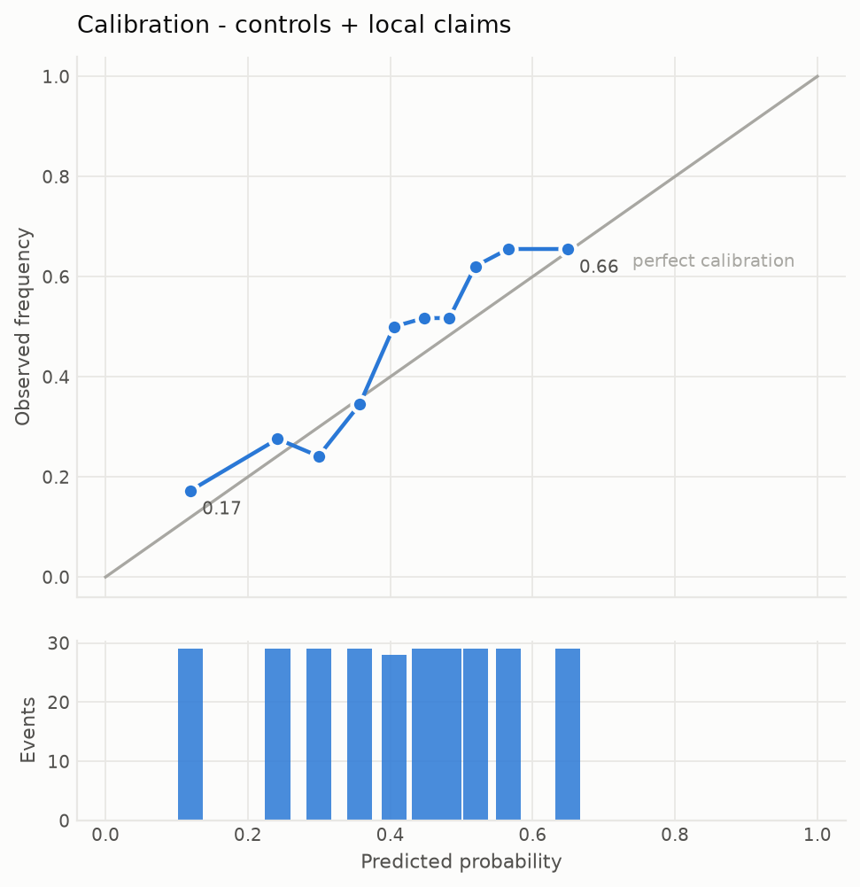
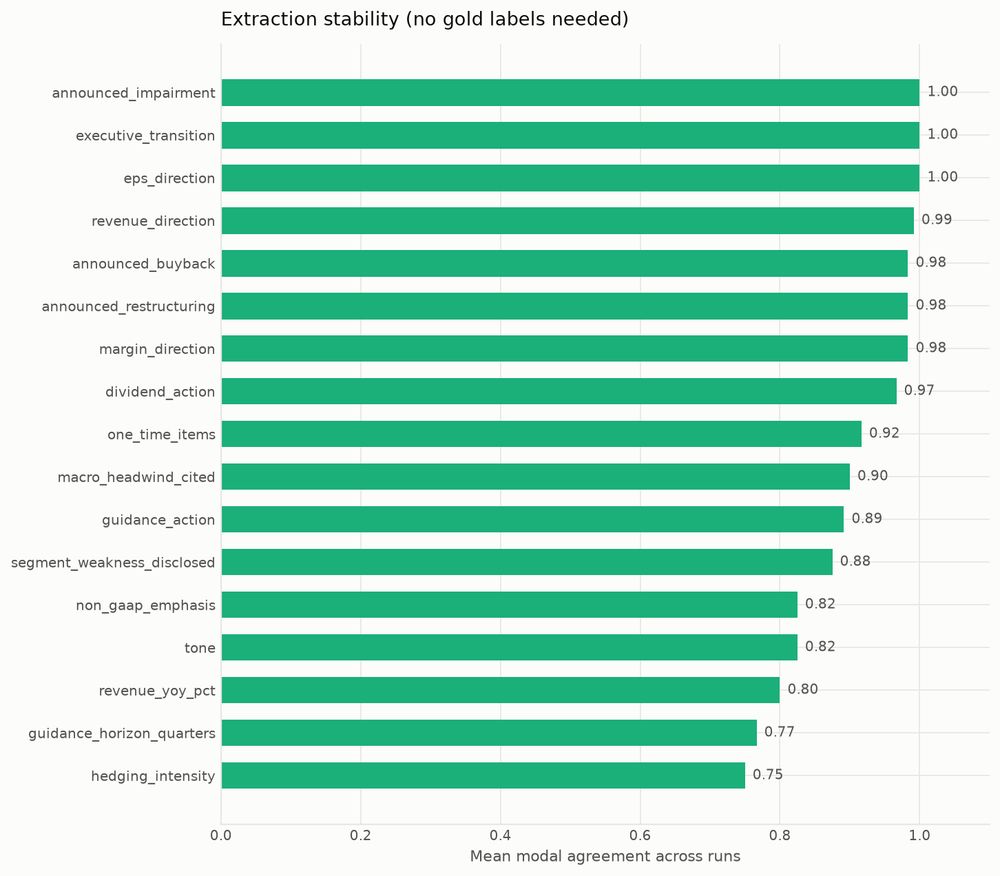
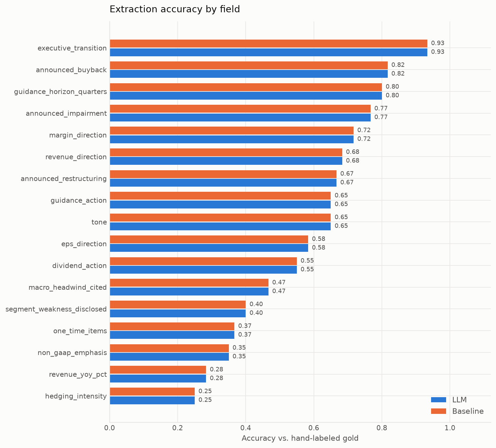

# Earnings Disclosure Signal Engine

An LLM extracts structured claims from SEC 8-K earnings releases; those claims become
features in a calibrated model predicting post-announcement volatility, with an eval
harness that measures extraction quality independently of downstream performance.

**Runs end-to-end for free.** The default extractor is a local model via Ollama, so
the whole pipeline reproduces on a laptop at zero API cost. A Claude backend is fully
implemented behind the same interface for anyone with a key, and comparing the two is
itself one of the results.

The question the project actually answers: **does an LLM reading an earnings release
tell you anything about upcoming volatility that the market's own state doesn't
already?** That framing forces two things most "LLM + finance" projects skip — a
measured extraction step, and an ablation that can come back negative.

**It came back negative.** Incremental AUC +0.0106, 95% CI [-0.0212, +0.0427].
The extraction works; the signal is not there at this sample size. What did hold
up is methodological: self-consistency predicts per-field accuracy at r = 0.715
(p = 0.0013), so extraction quality can be screened without labels.

---

## Pipeline

```
SEC EDGAR                Claude                   scikit-learn
─────────                ──────                   ────────────
8-K Item 2.02   ──┐
(earnings)        │   structured claims      calibrated classifier
                  ├──▶  (18 fields,     ──▶  P(vol expansion)  ──▶  ablation +
Exhibit 99.1    ──┘    JSON-schema                                   calibration
(press release)         constrained)                                 report
                                                      ▲
Yahoo Finance ──▶ realized-vol target ────────────────┘
                  + market-state controls
```

Two evaluation loops run independently:

| Loop | Question | Metrics |
|---|---|---|
| **Extraction** | Are the claims correct? | field accuracy, macro-F1, document exact-match, abstention precision/recall, self-consistency, confidence calibration |
| **Prediction** | Do the claims carry signal? | AUC, Brier skill, ECE, reliability curve, controls-only vs. claims-only vs. combined |

Three extractors implement one interface, so all of it runs unchanged on any of them:

| Extractor | Cost | What it is |
|---|---|---|
| `local` (default) | free | `qwen2.5:7b` via Ollama, schema-constrained decoding |
| `claude` | ~$18 for the corpus | Claude API with structured outputs |
| `baseline` | free | Rule-based regex/keyword extractor - the control |

Keeping them separate matters: a model can score well on volatility while the
extraction is mostly wrong (the features act as noisy sector dummies), and
extraction can be near-perfect while carrying no predictive signal at all. Only
measuring both tells you which situation you're in.

---

## What makes this non-trivial

**Event timing is a real leak, and it's the default bug.** Most earnings releases
cross the wire *after* the 16:00 ET close, so the first session that can trade on
the news is the *next* one. EDGAR reports acceptance time in UTC; the naive
`filing_date` treatment puts the announcement's own return inside the
"pre-announcement" baseline window for the majority of the sample. The pipeline
parses acceptance timestamps, converts UTC→Eastern with DST handled, and classifies
each release as pre-market / intraday / after-hours before choosing `t0`.
`tests/test_leakage.py::test_dst_boundary` pins the case where the same UTC clock
time falls on opposite sides of the close in summer and winter.

**The windows are strictly disjoint.** The target is realized vol over sessions
`[t0, t0+5)` divided by the baseline over `[t0-20, t0)`. Not one observation is
shared between them.

**Splits are time-ordered with an embargo.** Every fold trains on the past and
tests on the future, with a 10-day purge gap — because each label depends on a
5-session forward window, so a training event near the boundary would otherwise
have a label built from prices that overlap the test period.

**The baseline is a real attempt, not a strawman.** A rule-based extractor with
genuine regexes and curated cue lists runs the identical pipeline. If the LLM
can't beat keyword matching, the project should say so.

**Abstention is first-class.** Every categorical field has a `not_stated` member
and numerics are nullable, so "the release doesn't say" is a real answer rather
than something the model has to invent. Abstention precision and recall are
measured separately: over-abstaining discards signal, under-abstaining fabricates it.

---

## Two findings from building it

**Prompts are model-specific artifacts, and the failure is silent.** The system
prompt written for Claude is ~1,800 tokens and leans hard on abstention ("a wrong
confident answer is far more costly than an abstention"). On `qwen2.5:7b` that
framing dominated the model: measured across 12 releases that state a revenue
percentage in plain text, it produced a **null `revenue_yoy_pct` on 100% of them**,
and `margin_direction: not_stated` on 100%. A 40-token prompt recovered **100%
recall** on the same documents. An intermediate version carrying about half the
rules scored 75% - for this model, more instruction text monotonically increased
abstention.

The important part is *how* it failed. Every response was valid JSON, schema-conformant,
and confidently structured. Nothing downstream would have flagged it; the feature would
simply have been a constant column, and the ablation would have quietly reported that
LLM claims add no signal. Schema validation cannot catch this. Only measuring
extraction against known answers can. Both prompts are kept side by side in the repo
(`extract/llm.py`, `extract/local.py`).

**Half of an earnings release is not an earnings release.** Press releases are a
narrative followed by financial statement tables. Every field in the schema is
answerable from the narrative; none needs the tables. Trimming at the statement
header (`textprep.py`) cut the corpus **52%**, and - more importantly - took the
share of documents overflowing a 16k context window from **11.2% to zero**. Those
would have been truncated silently, producing confident claims based on partial text.

A third, smaller lesson: while measuring the above, a throwaway regex written to
approximate ground truth was itself wrong twice (`[^.]` doesn't match inside
"$109.4 billion"), first understating the model's recall and then overstating its
fabrication rate. That is the argument for a hand-labeled gold set rather than a
convenient proxy.

---

## Results

> **Status.** Both evaluation loops are complete on the full corpus - ablation,
> extraction accuracy, abstention and stability. The local model extracted all
> **1,447 filings with 0 failures** at $0 (6.23M prompt tokens, mean 28.8
> s/document). One result is missing and one carries a caveat:
>
> - **The Claude comparison is not run.** It needs `ANTHROPIC_API_KEY`, which
>   this checkout does not have, so the three-extractor comparison is a
>   two-extractor comparison. The README's "~$18 for the corpus" is an
>   unverified estimate, not a measurement.
> - **Extraction accuracy is measured, but against a model-labeled gold set.**
>   All 60 gold documents are labeled, and the rule-based control is graded
>   against them below - but the labels were produced by `claude-opus-5` reading
>   the filings, not by a human. That makes the control's numbers a comparison
>   against a strong-model reference, which is a real measurement and is *not*
>   accuracy against human ground truth; it also makes grading the `claude`
>   extractor against this set circular, so that is not reported. Provenance and
>   the labeling conventions are in `data/gold/LABELING.md`, and re-reviewing any
>   row by hand strictly improves the set.
>
> Every number below is regenerated from pipeline artifacts by `edse report` and
> none is hand-edited; `reports/REPORT.md` omits any section whose stage has not
> been run, which is why it is shorter than this file.

### Dataset

**1,445 labeled earnings events**, 40 large-cap issuers, 2018-01-12 to 2026-08-20.
Positive rate (post-announcement vol > 1.5x the pre-announcement baseline): **46.9%**.
Median vol expansion across all events: **1.44x** - earnings do raise volatility,
which is the sanity check the target has to pass before anything else is worth reading.

Release timing, which is the whole reason event-day alignment gets its own module:

| timing | events | share |
|---|---:|---:|
| pre-market | 942 | 65.2% |
| after-hours | 489 | 33.8% |
| intraday | 13 | 0.9% |
| non-session | 1 | 0.1% |

A third of this sample cannot trade on the news until the next session. Treating
`filing_date` as the event day would put the announcement's own return inside the
"pre-announcement" baseline for every one of those 489 events - and for the
`non_session` release, which crossed the wire on a day the market never opened.

### Prediction - rule-based control

| feature set | AUC | Brier | Brier skill | ECE |
|---|---:|---:|---:|---:|
| controls only | 0.686 | 0.225 | +0.092 | 0.061 |
| claims only | 0.553 | 0.246 | +0.007 | 0.080 |
| controls + claims | 0.685 | 0.226 | +0.087 | 0.064 |

**Keyword-extracted claims add nothing** (-0.001 AUC, -0.004 Brier skill). Market
state alone reaches 0.686 AUC, and pre-announcement realized volatility is by far the
strongest single feature (+0.091 AUC drop under permutation).

That is the bar, and it is the result that makes the ablation worth running: an
extractor can produce 1,447 clean, schema-valid records and still contribute zero
signal. The local model does not clear it either - **+0.0106 AUC with a 95% confidence
interval of [-0.0212, +0.0427]**. The section below reports that null result
rather than the point estimate.



The calibration is genuinely good - predictions track observed frequency closely -
but the histogram underneath is the honest part: predictions span roughly 0.14-0.62,
so the model is separating events weakly even where it is well-calibrated.



### Prediction - local-LLM claims

Full corpus, 1,445 events, gbm + isotonic calibration, purged time splits.

| feature set | AUC | Brier | Brier skill | ECE |
|---|---:|---:|---:|---:|
| controls only | 0.6864 | 0.2253 | +0.0916 | 0.0610 |
| claims only | 0.5137 | 0.2559 | -0.0316 | 0.0788 |
| controls + claims | **0.6970** | **0.2219** | **+0.1052** | **0.0552** |

The point estimate is +0.0106 AUC and +0.0137 Brier skill, against **-0.0012** for
keyword-extracted claims. A paired bootstrap over the 289 held-out events - 10,000
resamples, both models rescored on each draw - puts an interval on it:

| quantity | estimate | 95% CI | P(> 0) |
|---|---:|---:|---:|
| incremental AUC | +0.0106 | **[-0.0212, +0.0427]** | 0.742 |
| incremental Brier skill | +0.0137 | **[-0.0186, +0.0451]** | 0.799 |

**The interval straddles zero, so the answer is no.** A 7B model reading an
earnings release does not measurably tell you anything about upcoming volatility
that the market's own state does not already. The point estimate leans positive,
and there is roughly a 74% chance the true effect has the right sign, but that is
not a finding - it is a coin weighted slightly better than a coin.

Three things make the null reading the right one:

1. **The interval is three times the effect.** 289 test events cannot resolve a
   one-point AUC difference. That is a power problem, not a modeling problem, and
   no amount of tuning fixes it - the honest options are a larger corpus or a
   bigger expected effect.
2. **Claims alone are barely better than a coin flip** - 0.5137 AUC, and a
   *negative* Brier skill of -0.0316, meaning the claims-only model is worse
   calibrated than just predicting the base rate.
3. **Market state dominates.** `log_rv_pre` alone drops AUC by 0.0875 under
   permutation; the best claim feature, `dividend_action__increased`, drops it by
   0.0077 - an order of magnitude less.

This is the result the repo was built to be able to report. The extraction is good
(below: 0.712 field accuracy, and 0.800 on stated revenue percentages where the
regex manages 0.283), the pipeline is leakage-controlled, the claims are
schema-valid on all 1,447 filings - **and the signal still is not there.** Without
a confidence interval the +0.0106 would have been reportable as a win. The
interval is the difference between a finding and a number.





### Extraction quality - rule-based control

60 documents, 17 graded fields, against the model-labeled gold set described above.

| metric | rule-based | local LLM |
|---|---:|---:|
| mean field accuracy | 0.584 | **0.712** |
| mean macro-F1 | 0.490 | **0.629** |
| document exact match | 0.000 | 0.000 |
| worst field | `hedging_intensity` (0.25) | `hedging_intensity` (0.27) |

Unlike the ablation, **this gap is not subtle**: +12.8 points of field accuracy
and +13.9 of macro-F1. It is also the more interesting half of the project, because
it says *where* the model earns its place:

| field | rule-based | local LLM | delta |
|---|---:|---:|---:|
| `revenue_yoy_pct` | 0.283 | 0.800 | **+0.517** |
| `dividend_action` | 0.550 | 0.917 | +0.367 |
| `non_gaap_emphasis` | 0.350 | 0.633 | +0.283 |
| `revenue_direction` | 0.683 | 0.950 | +0.267 |
| `eps_direction` | 0.583 | 0.850 | +0.267 |
| `segment_weakness_disclosed` | 0.400 | 0.650 | +0.250 |
| `guidance_horizon_quarters` | 0.800 | 0.600 | -0.200 |
| `tone` | 0.650 | 0.467 | -0.183 |

The `revenue_yoy_pct` row is the third lesson above, now quantified: the regex
finds a stated revenue percentage 28% of the time, the model 80%. And the two
fields where the regex "wins" both come with a catch. On `tone` the model really
is worse, but both are bad and the regex's edge is mostly majority-class guessing -
macro-F1 is 0.273 against 0.319, a far smaller gap than accuracy suggests. On
`margin_direction` the regex wins accuracy by 0.100 while *losing* macro-F1 by
0.175: it scores by abstaining into the majority answer, which is the exact
pathology abstention metrics exist to expose.

`hedging_intensity` is the worst field for both extractors (0.25 and 0.27). A
0-3 ordinal for "density of hedging language" is the one field neither a regex nor
a 7B model can do, and it is the field most likely to be underspecified rather
than merely hard.

### Extraction stability, and the one result that is statistically solid

Three runs at temperature 1.0 over 40 documents, no gold labels needed. Mean modal
agreement **0.909**; least stable field `hedging_intensity` at 0.750, unanimous on
only 32.5% of documents.

The useful part is not the headline number, it is that **self-consistency predicts
accuracy**. Across all 17 graded fields, per-field agreement correlates with
per-field accuracy at **Pearson r = 0.715 (p = 0.0013)**, Spearman rho = 0.705
(p = 0.0016):

| field | agreement | accuracy |
|---|---:|---:|
| `hedging_intensity` | 0.750 | 0.267 |
| `guidance_horizon_quarters` | 0.767 | 0.600 |
| `tone` | 0.825 | 0.467 |
| ... | | |
| `revenue_direction` | 0.992 | 0.950 |
| `eps_direction` | 1.000 | 0.850 |
| `executive_transition` | 1.000 | 0.967 |

This matters because self-consistency **needs no labels and scales to the entire
corpus**, while accuracy needs a gold set that costs a human day. If agreement
tracks accuracy, you can screen which fields to trust on 1,447 documents instead of
60 - and decide a field is unusable before paying to label it.

Note the asymmetry: it is a one-way test. A field the model agrees with itself on
can still be confidently and consistently wrong (`announced_impairment` is
unanimous on every document and only 0.800 accurate). Low agreement is strong
evidence of a bad field; high agreement is weak evidence of a good one.

`hedging_intensity` sits at the bottom of *both* measurements - worst accuracy for
both extractors (0.25 and 0.27) and worst stability (0.750, unanimous on a third of
documents). Two independent measurements agreeing that a field is broken is the
case for the field being **underspecified rather than hard**: "density of hedging
language, 0-3" does not pin down what a 1 is versus a 2, so the model disagrees
with itself and with the labels for the same reason. That is a schema bug, not a
model failure, and it is the first thing I would fix next.

Three caveats: 17 fields is a small sample for a correlation, the accuracy side
inherits the model-labeled gold set's caveat, and this is a correlation *across
fields*, not a per-document predictor.



Abstention, the local model against the same gold set:

| field | gold abstains | model abstains | precision | recall |
|---|---:|---:|---:|---:|
| `dividend_action` | 81.7% | 80.0% | 0.979 | 0.959 |
| `margin_direction` | 65.0% | 26.7% | 1.000 | 0.410 |
| `guidance_action` | 28.3% | 41.7% | 0.640 | 0.941 |
| `revenue_yoy_pct` | 20.0% | 6.7% | 1.000 | 0.333 |

The model's abstention failure is the **mirror image** of the baseline's. The
regex over-abstained on `revenue_yoy_pct` (53% against a gold 20%), missing
percentages that were printed in plain text. The model under-abstains - 6.7%
against a gold 20%, and 26.7% against 65% on `margin_direction` - answering where
the release says nothing. Its abstentions are almost always right when it makes
them (precision 1.000 on both), it just does not make enough of them. That is the
same bias the prompt-portability finding above created: the short prompt that
recovered recall also taught the model to answer rather than decline.

**The control never gets a whole filing right** - not once in 60 documents, across
17 fields. That is the number that makes the ablation above legible: keyword
extraction produces schema-valid records for every filing and contributes nothing
to the volatility model, and this is why.

The abstention split is the more useful half, because the two failure directions
have opposite consequences and a single accuracy number hides both:

| field | gold abstains | control abstains | precision | recall |
|---|---:|---:|---:|---:|
| `dividend_action` | 81.7% | 41.7% | 1.000 | 0.510 |
| `margin_direction` | 65.0% | 45.0% | 0.963 | 0.667 |
| `revenue_yoy_pct` | 20.0% | 53.3% | 0.188 | 0.500 |
| `revenue_direction` | 8.3% | 25.0% | 0.200 | 0.600 |

Two opposite pathologies in one extractor. On `dividend_action` it **under-abstains**
- it answers where it should stay silent, inventing dividend actions in releases
that mention a dividend without changing one. On `revenue_yoy_pct` it
**over-abstains** - it returns null on half the filings that state a revenue
percentage in plain text, which is the regex failure the third lesson above
describes, now measured rather than anecdotal.

And the control reports `confidence: 2` on all 60 documents, so its
confidence-accuracy calibration is undefined. A constant confidence is not a
calibration failure, it is the absence of the signal - worth knowing before
trusting any extractor's self-report.



---

## Quickstart

```bash
python3 -m venv .venv && ./.venv/bin/pip install -e ".[dev]"
cp .env.example .env          # add EDGAR_USER_AGENT (required) and ANTHROPIC_API_KEY
```

`EDGAR_USER_AGENT` must contain a contact email — SEC blocks anonymous clients,
and the failure mode is silent (empty result sets), so the code refuses to start
without one.

For the free local extractor:

```bash
brew install ollama
OLLAMA_NUM_PARALLEL=2 ollama serve &     # see "On local concurrency" below
ollama pull qwen2.5:7b
```

```bash
edse universe                 # resolve tickers -> CIKs via SEC's own mapping
edse ingest                   # download 8-K Item 2.02 press-release exhibits
edse prices                   # daily OHLCV for the universe + SPY
edse label                    # event-time alignment and the volatility target

edse extract --extractor local        # free, local model (default)
edse extract --extractor baseline     # free, rules only
edse extract --extractor claude       # needs ANTHROPIC_API_KEY

edse train --extractor local          # ablation, calibration, figures
edse report                           # assemble reports/REPORT.md
```

`ANTHROPIC_API_KEY` is only needed for `--extractor claude`. Everything else, including
every figure and metric in this README, runs without it.

Extraction stability needs no labels, and is part of the default results:

```bash
edse consistency --runs 3             # re-extract at temperature 1.0, measure agreement
```

Extraction *accuracy* does need hand labels:

```bash
edse gold --sample 60                 # stratified labeling template
python scripts/label_gold.py          # review it field by field (see below)
edse eval-extraction                  # grade the extractors against it
```

`scripts/label_gold.py` walks the template one filing at a time, showing the *same
trimmed narrative the extractor is given* — so a gold label is never based on text
the model could not see — with the rubric for each field pulled from `schema.py` and
the prefill from the rule-based extractor. It never displays the LLM's own answer,
since anchoring to the system under evaluation would inflate every score. Progress
saves after each document. Use it to re-review rows by hand: the committed labels
are model-made (see *On gold-label anchoring* below), and a hand pass over any row
strictly improves the set.

Extraction is cached on disk, keyed by `(extractor, model, prompt_version,
document_text)`. A re-run after a crash re-extracts only what's missing, and
editing the prompt invalidates the cache instead of silently mixing prompt
versions into one dataset.

---

## Design decisions

**Why 8-K Item 2.02 rather than full-text search.** EDGAR tags each 8-K with the
Items it reports; Item 2.02 *is* "Results of Operations and Financial Condition."
Filtering on the tag gives a precise, reproducible event set with no keyword
guesswork. The narrative itself is almost never in the 8-K body — it's furnished as
Exhibit 99.1, resolved from the filing's SGML document table. (`index.json` is not
usable for this: its `type` field holds the icon filename, not the exhibit type.)

**Why volatility expansion rather than direction.** Direction prediction from public
filings at the moment of release is close to a market-efficiency claim. Volatility
is the honest target: it's genuinely uncertain, it's what options markets price, and
disclosure characteristics plausibly inform it. A ratio to the pre-announcement
baseline also normalizes away persistent cross-sectional differences — without it
the model would mostly learn which tickers are volatile.

**Why the schema descriptions are the prompt.** Field descriptions in
`src/edse/schema.py` are the extraction instructions, so there's one source of
truth. The system prompt carries only cross-cutting rules and the judgment calls a
schema can't express.

**Why Haiku 4.5 by default.** A bulk extractor over ~1.4k documents is the case
where a cheaper model earns its place. `configs/config.yaml` sets `quality_model:
claude-opus-5` for a subset comparison — run `edse extract --model claude-opus-5
--limit 100` and grade both against the same gold set to see what the cheap model
costs you in accuracy.

**On prompt caching — measured, not assumed.** The system prompt is a frozen prefix
marked with `cache_control`, with per-document text after the breakpoint. Whether
the cache actually engages is model-dependent: the API only caches prefixes above a
minimum length (~1024 tokens for Sonnet/Opus, 2048 for Haiku). This prompt is ~1.7k
tokens, so it caches on Sonnet/Opus and most likely **does not** on Haiku 4.5, the
default. The prompt is deliberately not padded to cross that line — padding would
burn real tokens on every uncached call to manufacture a metric. Instead
`reports/extraction_stats_*.json` reports measured `cache_hit_rate`, so the answer
is observed.

**On local concurrency — the claim this README got wrong.** This file used to
state that concurrent requests "just queue inside Ollama and add no throughput",
and `cli.py` hard-coded one worker for the local extractor on that basis. It was
reasoned, not measured, and it was wrong. Two length-balanced 12-document arms
(prompt-token volume within 0.8%), serial versus two concurrent requests against
a server started with `OLLAMA_NUM_PARALLEL=2`:

| | `NUM_PARALLEL=1` | `NUM_PARALLEL=2` |
|---|---:|---:|
| wall clock, 12 documents | 238.8 s | 189.1 s |
| prompt tokens/s | 221.2 | 281.7 |
| output tokens/s | 11.1 | 14.2 |
| median request latency | 17.2 s | 25.0 s |

**1.27x the throughput**, agreeing across wall clock, prompt tokens and output
tokens — while per-request latency rose 1.45x. Latency up *and* throughput up is
batching; pure queuing would have raised latency and left throughput flat. So
the shape of the original claim was right (each request does get slower) and its
conclusion was wrong.

Two reasons the gain is well under 2x, both worth knowing before turning the dial
up. This workload is prefill-dominated — 20:1 prompt to output tokens — and
prefill already saturates the GPU, so there is little idle compute for a second
request to use. And Ollama preserves the per-slot `local_num_ctx` by scaling
total context (`-c 65536 -np 2`), which cost enough memory that it halved the
physical batch (`-ub 1024` to `-ub 512`) and made prefill itself less efficient.
On this 16 GiB machine (11.8 GiB usable) a third slot would reach ~10.3 GB with
weights and shrink the batch again, so `local_max_workers` is 2.

At corpus scale the gain is larger, and getting there required throwing out
s/document as a metric. The corpus is ordered by issuer, so consecutive
documents are not a sample: one stretch of the production run slowed to 21.9
s/document and looked like a regression, but its filings averaged 7,205 prompt
tokens against 1,705 earlier - 4.2x longer - and on a throughput basis it was
the *fastest* window observed, at 346 prompt tokens/s. Comparing two windows at
matched mean prompt length instead:

| corpus window | mean prompt tokens | prompt tokens/s |
|---|---:|---:|
| serial, 73 documents | 1,767 | 131.0 |
| two workers, 54 documents | 1,705 | 199.3 |

**1.52x**, against 1.27x in the controlled benchmark above. The benchmark
sampled across the whole length distribution (~4.4k prompt tokens/document) and
these windows are ~1.7k, which is the direction you would expect: shorter
documents spend proportionally more time in decode, and decode is the part that
batches well. Read the two numbers as a range that depends on document length,
not as one estimate and one error.

The cost is memory, and it is the reason `local_max_workers` is 2 rather than
higher. Two slots hold ~8.4 GB resident (7.68 GB of it the `llama-server`
process) on a 16 GiB machine, which is enough to push the system into swap
during a long run. That is survivable here because extraction is cached and
resumable, but it is the constraint that binds first - not GPU throughput.

The part that generalizes: **the speedup only exists if the server was started
with a matching `OLLAMA_NUM_PARALLEL`.** Against the default of 1 the requests
really do queue, and a client sending two at once pays the extra latency for no
throughput at all — the original claim, correctly describing a misconfiguration.

**On gold-label anchoring, and what the gold set actually is.** `edse gold`
pre-fills rows from the *rule-based* extractor, never the LLM, because pre-filling
from the system under evaluation would anchor the labeler toward its answers and
inflate every downstream score. `--prefill none` gives blank rows.

The set in this repo was labeled by `claude-opus-5` reading the filings rather than
by a human, and every row records that in `_labeled_by`. Two consequences worth
being blunt about: grading the `claude` extractor against it is circular and is not
reported, and the rule-based numbers above are agreement with a strong-model
reference rather than accuracy against ground truth. The prefill was not shown
while labeling, and the labels diverge from it on **45% of graded fields** - most on
`non_gaap_emphasis` (20% agreement), `revenue_yoy_pct` (20%) and `hedging_intensity`
(30%), which is where a regex should be expected to fail. That divergence is the
evidence the set is not a copy of the baseline; it is not evidence that the labels
are right. `data/gold/LABELING.md` records the provenance and every recurring
judgement call, so a human re-review can disagree with a specific convention rather
than with the whole set.

---

## Layout

```
src/edse/
  schema.py            18-field claim schema; descriptions double as prompt text
  config.py            config + env loading
  ingest/edgar.py      8-K discovery, exhibit resolution, HTML→text
  ingest/prices.py     daily prices, returns, trading calendar
  labels.py            event-time alignment + volatility target      ← leakage-critical
  features.py          claims + market state → matrix, in named blocks
  model.py             purged time splits, calibration, ablation     ← leakage-critical
  textprep.py          narrative trimming + guidance recovery         ← see findings
  extract/llm.py       Claude extractor (structured outputs)
  extract/local.py     Ollama extractor, schema-constrained decoding
  extract/baseline.py  rule-based extractor
  eval/extraction.py   accuracy, abstention, consistency, confidence
  eval/plots.py        report figures
  cli.py, cli_eval.py  command-line pipeline
scripts/label_gold.py  interactive gold-label review
data/gold/LABELING.md  gold-label provenance and field conventions
scripts/bench_local_concurrency.py   the local-concurrency measurement
scripts/build_site.py  renders the published GitHub Pages site
tests/                 79 tests; test_leakage.py covers the split/timing logic
```

## Tests

```bash
./.venv/bin/python -m pytest tests/ -q
```

`tests/test_leakage.py` is the set that matters — a leak makes the project *look*
right while being worthless, so the embargo, the chronological ordering, the
event-day resolution, and the DST boundary are all asserted directly.

---

## Limitations

- **Yahoo Finance data.** Free, occasionally revised, and not survivorship-bias-free.
  The universe is chosen from companies that exist today, which biases toward
  survivors. Fine for a methods demonstration; not a backtest you'd trade.
- **40 large caps.** Mega-cap disclosure practice is not small-cap disclosure
  practice, and the results shouldn't be extrapolated there.
- **Realized vol from daily closes** is a coarse estimator over a 5-day window.
  Intraday or options-implied vol would be sharper.
- **The gold set is small and model-labeled.** Field accuracy on 60 documents
  carries wide confidence intervals, and the labels come from `claude-opus-5`
  reading the filings rather than from a human, so they measure agreement with a
  strong-model reference rather than accuracy against ground truth. Two fields are
  near-constant on this sample - `executive_transition` is true once in 60 - so
  their macro-F1 carries almost no information. Self-consistency is reported partly
  because it needs no labels at all and scales to the full corpus.
- **This is not trading advice or a trading system.** There is no execution model, no
  transaction costs, and no position sizing.
